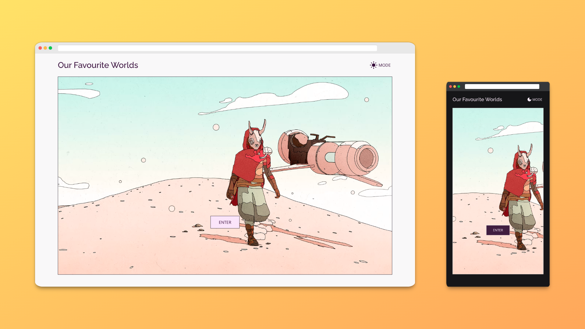

<h1 align="center">Our Favourite Worlds</h1>

React frontend (viewing) for the Blog API

## Description
(Currently in progress). This site is the viewing frontend for The Odin Project [Blog API](https://www.theodinproject.com/lessons/nodejs-blog-api) assignment. It is responsible for post views, comment authoring, and user login (with jwt management) for comments.

## Project Objectives
- Fetch posts, authors, and comments from GET endpoints
- Manage user login (for comment posting) with JSON Web Tokens

## Features
- Client-side routing
- Lazy-loaded and progressively enhanced images using the Cloudinary React SDK
- Light and dark mode

## Technologies used
- [React](https://reactjs.org/)
- [Typescript](https://www.typescriptlang.org/)
- [Vite](https://vitejs.dev/)
- [Axios](https://axios-http.com/) Promise-based HTTP client for browser and node.js
- [React Router](https://reactrouter.com/en/main) Client-side Routing
- [Cloudinary React SDK](https://github.com/cloudinary/frontend-frameworks/tree/master/packages/react) React Integration for Cloudinary
- [Vanilla Extract](https://vanilla-extract.style/) Zero-runtime stylesheets in TypeScript

## Roadmap
- [ ] Add login & user flow for comments
- [ ] Set up msw to mock backend for testing
- [ ] (Possibly) move from React Router to [React Location](https://react-location.tanstack.com/) to see if that can fix the flash of 404 when refreshing on parameterized routes that use parent component data

## Credits and Attributions
The welcome screen image is Sable, copyright [Shedworks](https://www.shed-works.co.uk/) and available for download here: [Sable Wallpapers - Shedworks](https://www.shed-works.co.uk/wallpapers)

I'm very much *not* a designer and tried to replicate some of the visual features from these sites:
- [Azrieli School of Architecture](https://architecture.carleton.ca/)
- [William Chyr](https://williamchyr.com/)
- [Buried Treasure](https://buried-treasure.org/)

And, in particular, the [Behance Blog](https://www.behance.net/blog) for post design.
